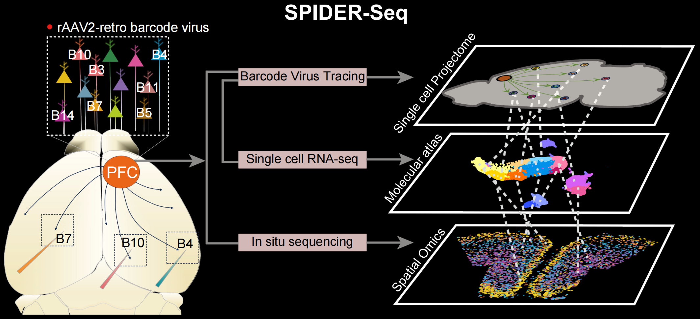

# SPIDER-seq

Single-cell Projectome-transcriptome In situ Deciphering Sequencing


## Abstract

Deciphering the connectome, anatomy, transcriptome and spatial-omics integrated multi-modal brain atlas and the underlying organization principles remains a great challenge. We developed a **Single-cell Projectome-transcriptome In situ Deciphering Sequencing (SPIDER-Seq)** technique by combining viral barcoding tracing with single-cell sequencing and spatial-omics. This empowers us to delineate a integrated single-cell spatial molecular, cellular, anatomic and projectomic atlas of mouse prefrontal cortex (PFC). The projectomic and transcriptomic cell clusters display distinct modular organization principles, but are coordinately configured in the PFC. The projection neurons gradiently occupied different territories in the PFC aligning with their wiring patterns. Importantly, they show higher co-projection probability to the downstream nuclei with reciprocal circuit connections. Moreover, we integrated projectomic atlas with their distinct spectrum of neurotransmitter/neuropeptide and the receptors-related gene profiles and depicted PFC neural signal transmission network. By which, we uncovered potential mechanisms underlying the complexity and specificity of neural transmission. Finally, leveraging machine learning, we predicted neuron projections with high accuracy by combining gene profiles and spatial information. As a proof of concept, we used this model to predict projections of fear recall engram neurons. This study facilitates our understanding of brain multi-modal network and neural computation.




## Data Visualization

We developed a shiny application **SPIDER-web** that allows users to interactively access our data. You can access our online website at <https://huggingface.co/spaces/TigerZheng/SPIDER-web>


Users can browse the following content through the scRNAseq page:

- scRNAseq Clustering: Select different resolutions to view cell clusters on UMAP
- Gene Expression: Select different genes to view their expression on UMAP
- Barcode Expression: Select different projections to view their expression on UMAP
- Barcode Cell Numbers: View PFC projection cell numbers in different cell clusters

Users can browse the following content through the spatial page:

- Spatial Clustering: Select different resolutions to view the spatial distribution of cell clusters
- Spatial Gene Expression: Select different genes to view their spatial expression
- Spatial Barcode Expression: Select different projections to view their spatial expression
- Barcode Spatial Distribution: View the spatial distribution of PFC projection neurons along anterior-posterior and ventralis-dorsalis axes

Users can browse the following content through the 3D page:

- Transcriptome 3D Visualization: Select different transcriptome cell clusters to interactively view them in 3D
- Projectome 3D Visualization: Select different Projectome targets to interactively view them in 3D


## Code View

The code for all the figures in this study can be accessed at `Main Figures` and `Supplementary Figures` files. 


## Citation

Our project has been released in the following publication:

```
Sun L, Zheng H, et al. Organization of mouse prefrontal cortex subnetwork revealed by spatial
single-cell multi-omic analysis of SPIDER-Seq. National Science Review.
```
